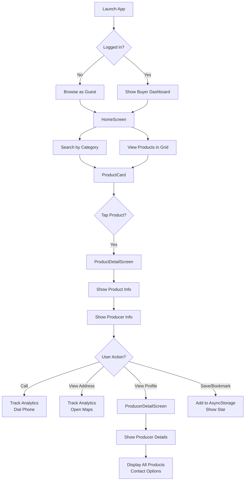
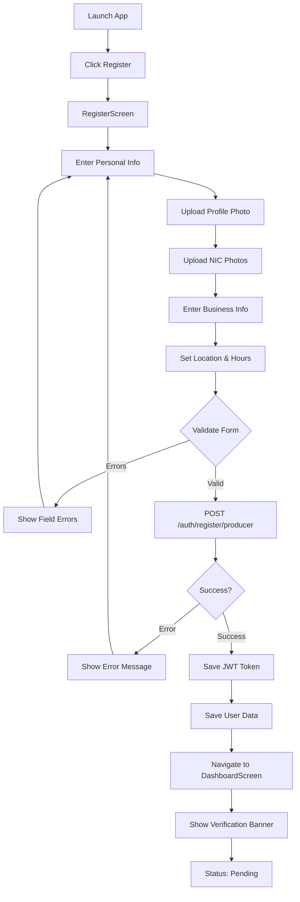

# Lanka Agri-Direct Mobile App - Comprehensive Analysis & Workflow

## Executive Summary

**Mobile App Type**: Cross-platform (iOS & Android via React Native + Expo)  
**Framework**: React Native with Expo  
**Architecture**: Role-based navigation with Context API for state management  
**Backend**: Node.js/Express API (REST)  
**Database**: MongoDB (NoSQL)  
**Development Status**: Production-ready

---

## 1. App Architecture Overview

### Technology Stack

| Layer | Technology |
|-------|-----------|
| **Frontend** | React Native (Expo) |
| **State Management** | React Context API + AsyncStorage |
| **Navigation** | React Navigation (v5+) |
| **HTTP Client** | Axios |
| **Image Upload** | Cloudinary |
| **Authentication** | JWT (stored in AsyncStorage) |
| **DatePicker/TimePicker** | React Native Date/Time Pickers |
| **Styling** | StyleSheet (React Native) |
| **Testing** | Jest |

### Project Structure

```
mobile-app/
├── src/
│   ├── api/                          # API layer
│   │   ├── axiosInstance.js          # HTTP client configuration
│   │   ├── authApi.js                # Auth endpoints
│   │   ├── producerApi.js            # Producer endpoints
│   │   ├── productApi.js             # Product endpoints
│   │   ├── analyticsApi.js           # Analytics endpoints
│   │   └── cloudinaryUpload.js       # Image upload service
│   │
│   ├── context/                      # State management
│   │   └── AuthContext.js            # User auth state
│   │
│   ├── navigation/                   # Screen navigation
│   │   ├── AppNavigator.js           # Root navigator (role-based)
│   │   ├── BuyerNavigator.js         # Buyer screens (bottom tabs)
│   │   └── ProducerNavigator.js      # Producer screens (stack)
│   │
│   ├── screens/                      # Screen components
│   │   ├── auth/
│   │   │   ├── LoginScreen.js        # Login form
│   │   │   └── RegisterScreen.js     # Producer registration
│   │   ├── buyer/
│   │   │   ├── HomeScreen.js         # Product discovery
│   │   │   ├── ProductDetailScreen.js # Product details + producer info
│   │   │   ├── ProducerDetailScreen.js # Producer profile
│   │   │   └── BookmarksScreen.js    # Saved producers
│   │   └── producer/
│   │       ├── DashboardScreen.js    # Producer dashboard
│   │       ├── MyProductsScreen.js   # Producer product list
│   │       ├── AddProductScreen.js   # Create/edit products
│   │       └── AccountSettingsScreen.js # Profile management
│   │
│   ├── components/                   # Reusable components
│   │   ├── AppButton.js              # Custom button
│   │   ├── AppInput.js               # Custom input field
│   │   ├── AlertBox.js               # Alert/message box
│   │   ├── ProductCard.js            # Product card (list item)
│   │   ├── DaySelector.js            # Day of week selector
│   │   ├── TimeInput.js              # Time picker
│   │   └── VerificationBanner.js     # Status notification
│   │
│   ├── theme/                        # Design system
│   │   └── colors.js                 # Color palette, dimensions
│   │
│   └── App.tsx                       # Root component
│
├── __tests__/                        # Jest unit tests
├── android/                          # Android native (Gradle)
├── ios/                              # iOS native (Xcode)
├── app.json                          # Expo configuration
├── package.json                      # Dependencies & scripts
└── tsconfig.json                     # TypeScript config
```

---

## 2. User Roles & Navigation Structure

### 2.1 Unauthenticated Users (Guests)

```
┌─────────────────────┐
│   AppNavigator      │
│   (Root)            │
└──────────┬──────────┘
           │
    ┌──────┴──────┐
    │ No Token    │
    │ user = null │
    └──────┬──────┘
           │
      ┌────▼─────┐
      │ AuthStack │
      └────┬─────┘
           │
    ┌──────┴──────────┐
    │                 │
┌───▼──────┐     ┌───▼──────┐
│ Login    │◄───►│ Register │
│ Screen   │     │ Screen   │
└──────────┘     └──────────┘
```

**Features**:
- Browse products anonymously
- View producer profiles
- Create account as Producer

---

### 2.2 Buyer User Flow

```
┌─ Authenticated ─┐
│ role = "BUYER"  │
└────────┬────────┘
         │
    ┌────▼─────────────────────┐
    │   BuyerNavigator         │
    │   (Bottom Tab Navigator) │
    └────┬─────────────────────┘
         │
    ┌────┴─────────────────────────────┐
    │                                   │
┌───▼──────┐  ┌───────────┐  ┌────────▼──┐
│ Browse   │  │ Bookmarks │  │ Account   │
│ (HomeTab)│  │ (SavedTab)│  │ (Settings)│
└───┬──────┘  └─────┬─────┘  └───┬──────┘
    │               │            │
    │          ┌────▼────┐       │
    │          │Tap item │       │
    │          │reveals  │       │
    │          │producer │       │
    │          └────┬────┘       │
    │               │            │
┌───▼──────────────▼─────┬───────▼──────┐
│ ProductDetailScreen    │ Bookmarks    │
│ - Product info         │ Stack        │
│ - Producer info    ◄───┴─┐            │
│ - Save producer ★      │              │
│ - Call farmer          │              │
│ - View address         │  ┌──────────▼┐
│ - View producer    ┬───┘  │ Producer  │
└───────────┬────────┘      │ Detail    │
            │               └───┬───────┘
    ┌───────▼──────────────┐   │
    │ProducerDetailScreen  │◄──┘
    │- Profile info        │
    │- Contact            │
    │- Products list      │
    │- Download to maps   │
    └──────────────────────┘
```

**Buyer Features**:
- 🏠 **Browse**: Search/filter products by category, location
- ⭐ **Save**: Bookmark favorite producers for quick access
- 📱 **Contact**: Call farmers directly, view their location
- 👤 **Profiles**: View producer details and all their products
- 📍 **Maps**: View producer location on Google Maps

---

### 2.3 Producer User Flow

```
┌──────────────────────┐
│  Authenticated       │
│  role = "PRODUCER"   │
└─────────┬────────────┘
          │
    ┌─────▼──────────────────────┐
    │  ProducerNavigator         │
    │  (Stack Navigator)         │
    └─────┬──────────────────────┘
          │
    ┌─────▼────────────────────────────────────┐
    │         Dashboard (Main Hub)              │
    │  - Verification status                   │
    │  - Lead analytics (calls, views)         │
    │  - Quick action buttons                  │
    └─┬──────────────────────────────┬──────────┘
      │                              │
      │ ┌────────────┐           ┌───▼────────┐
      │ │ leads      │           │ Navigation │
      │ │ (calls)    │           │ Menu       │
      │ └────┬───────┘           └────┬──────┘
      │      │                        │
┌─────▼──────▼────────┐  ┌───────────▼──────────┐
│ My Products Screen  │  │ Edit Settings        │
│- Product list      │  │- Profile photo      │
│- Add product ➕     │  │- Store title        │
│- Edit items        │  │- Operating hours    │
│- Mark sold out     │  │- Location details   │
└──────┬──────────────┘  │- Contact info      │
       │                 └────────────────────┘
    ┌──▼────────────────┐
    │ Add/Edit Product  │
    │- Name             │
    │- Category         │
    │- Price & unit     │
    │- Upload photos    │
    │- Description      │
    └───────────────────┘
```

**Producer Features**:
- 📊 **Dashboard**: View lead analytics (calls, location views)
- ⭐ **Verification**: See pending/verified/blocked status
- 📦 **Product Management**: Add, edit, delete products
- 📸 **Upload**: Add multiple product images to Cloudinary
- 🛍️ **Sold Out**: Mark products as available/sold out
- ⚙️ **Settings**: Update profile, store info, location, hours

---

## 3. Detailed User Workflows

### 3.1 Buyer - Product Discovery & Contact



**Step-by-Step**:
1. User opens app → HomeScreen loads product list
2. User searches or filters by category
3. User taps a product card → ProductDetailScreen
4. User sees product details + producer info
5. User can:
   - **Call Farmer**: `Linking.openURL('tel:...')` + analytics tracking
   - **View Address**: `Linking.openURL('geo:...')` for maps + analytics
   - **Save Producer**: Bookmark saved to AsyncStorage
   - **View Profile**: Navigate to ProducerDetailScreen

---

### 3.2 Producer - Registration & Onboarding



**Step-by-Step**:
1. Tap "Create Account" on LoginScreen
2. Fill registration form:
   - Personal: First name, Last name, NIC
   - Business: Store title, Business type
   - NIC photos: Front & back (upload to Cloudinary)
   - Profile picture (upload to Cloudinary)
   - Contact: Phone number, email
   - Location: Address, GPS coordinates, Operating hours
3. Submit → Backend validates & creates account
4. Receive JWT token → Stored in AsyncStorage
5. User object saved → Navigation updates
6. Show DashboardScreen with "Pending Verification" banner

---

### 3.3 Producer - Add Product Workflow

```mermaid
graph TD
    A[Dashboard] --> B[Tap My Products]
    B --> C[MyProductsScreen]
    C --> D[Show Product List]
    D --> E{Tap Actions?}
    E -->|Add| F[AddProductScreen]
    E -->|Edit| G[AddProductScreen<br/>Pre-filled]
    E -->|Delete| H[Confirm Delete]
    H --> I[DELETE /products/{id}]
    F --> J[Enter Product Name]
    J --> K[Select Category]
    K --> L[Enter Price & Unit]
    L --> M[Enter Description]
    M --> N[Upload Product Image]
    N --> O{Image Upload?}
    O -->|Upload| P[Upload to Cloudinary]
    P --> Q[Get Image URL]
    O -->|Skip| Q
    Q --> R[Validate Form]
    R --> S{Valid?}
    S -->|No| T[Show Errors]
    T --> J
    S -->|Yes| U[POST /products]
    U --> V{Success?}
    V -->|Error| W[Show Error]
    W --> J
    V -->|Success| X[Refresh Product List]
    X --> C
```

**Step-by-Step**:
1. Navigate to My Products screen
2. Tap "➕ Add Product" button
3. Fill product form:
   - Product name
   - Category (dropdown)
   - Unit type (kg, piece, etc.)
   - Unit price
   - Description
   - Product image (pick from device)
4. Image upload to Cloudinary → Get URL
5. Form validation
6. Submit POST `/products`
7. Backend creates product record
8. Refresh product list → Show new item

---

### 3.4 Authentication Flow

```
┌─────────────────────────────────────────┐
│        Login / Register Flow             │
└──────────────┬──────────────────────────┘
               │
        ┌──────▼──────┐
        │ User enters │
        │ credentials │
        └──────┬──────┘
               │
        ┌──────▼────────────────┐
        │ POST /auth/login      │
        │ { email, password }   │
        └──────┬────────────────┘
               │
        ┌──────▼──────────────────┐
        │ Backend validates       │
        │ Returns:                │
        │ - JWT token            │
        │ - User data (role)     │
        └──────┬──────────────────┘
               │
        ┌──────▼──────────────────────┐
        │ Save to AsyncStorage        │
        │ - auth_token (JWT)         │
        │ - auth_user (JSON)         │
        └──────┬──────────────────────┘
               │
        ┌──────▼──────────────────────┐
        │ Update AuthContext State    │
        │ - user = {...}             │
        │ - token = JWT              │
        │ - loading = false          │
        └──────┬──────────────────────┘
               │
        ┌──────▼──────────────────────┐
        │ AppNavigator re-renders     │
        │ Shows role-based screens    │
        └─────────────────────────────┘
```

**Session Persistence**:
1. App starts → AuthContext.restoreSession() called
2. Reads from AsyncStorage → Gets stored token & user
3. If valid → Sets user state → Shows app
4. If invalid → Shows auth screens

---

## 4. Key Features & Functionality

### 4.1 Buyer Features

| Feature | Purpose | API Endpoint |
|---------|---------|--------------|
| **Browse Products** | Search & filter products | `GET /products?category=...&page=...` |
| **Product Details** | View product & producer info | `GET /products/{id}` |
| **Call Producer** | Click-to-call functionality | `POST /analytics/call` (tracking) |
| **View Location** | Open maps to producer location | `POST /analytics/address-view` (tracking) |
| **Save Producer** | Bookmark producers | AsyncStorage (local) |
| **Producer Profile** | View all producer details & products | `GET /producers/{id}` |

### 4.2 Producer Features

| Feature | Purpose | API Endpoint |
|---------|---------|--------------|
| **Register Account** | Create producer profile | `POST /auth/register/producer` |
| **Dashboard Analytics** | View lead metrics | `GET /analytics/my-analytics` |
| **Add Product** | Create product listing | `POST /products` |
| **Edit Product** | Update product details | `PUT /products/{id}` |
| **Delete Product** | Remove product listing | `DELETE /products/{id}` |
| **Upload Images** | Image hosting (Cloudinary) | Cloudinary API |
| **Mark Sold Out** | Toggle product availability | `PUT /products/{id}` |
| **Update Profile** | Modify producer information | `PUT /auth/profile` |
| **Operating Hours** | Set business hours | Part of profile update |

### 4.3 Analytics Tracking

```javascript
// Tracked Events
actionType: "clicked_call"       // When buyer calls producer
actionType: "viewed_address"     // When buyer views location

// Data Collected
- producerId              // Target producer
- buyerDeviceId          // Anonymous device ID
- timestamp              // When action occurred
- actionType             // Which action

// Purpose
- Show producers their lead volume
- Measure buyer engagement
- No personal buyer data collected (privacy-compliant)
```

---

## 5. State Management (React Context)

### 5.1 AuthContext State Structure

```javascript
{
  // User Data
  user: {
    id: "6a0d09b8fea267b9d0d3cef0",
    email: "john@example.com",
    firstName: "John",
    lastName: "Doe",
    role: "PRODUCER" | "BUYER",
    verificationStatus: "pending" | "verified" | "blocked",
    profilePictureUrl: "https://...",
    storeTitle: "John's Garden",
    district: "Colombo",
    province: "Western"
  },
  
  // Authentication
  token: "eyJhbGciOiJIUzI1NiIs...",  // JWT
  
  // Status Flags
  loading: false,
  error: null,
  
  // Utility Methods
  signIn,
  signOut,
  refreshUser,
  isProducer,
  isAdmin,
  isVerified
}
```

### 5.2 Context Methods

```javascript
// Sign in user
signIn(authResponse) 
  └─ Saves token & user to AsyncStorage
  └─ Updates AuthContext state

// Sign out user
signOut()
  └─ Removes all data from AsyncStorage
  └─ Clears AuthContext state

// Refresh user data from backend
refreshUser()
  └─ Calls GET /auth/me
  └─ Updates user object

// Helper methods
isProducer()    // Returns true if user.role === "PRODUCER"
isAdmin()       // Returns true if user.role === "ADMIN"
isVerified()    // Returns true if verificationStatus === "verified"
```

---

## 6. API Integration

### 6.1 API Base Configuration

```javascript
// axiosInstance.js
const instance = axios.create({
  baseURL: 'http://backend:8080/api/v1',
  timeout: 10000
});

// Auto-attach JWT token to every request
instance.interceptors.request.use(config => {
  const token = AsyncStorage.getItem('auth_token');
  if (token) {
    config.headers.Authorization = `Bearer ${token}`;
  }
  return config;
});

// Handle errors (e.g., 401 → redirect to login)
instance.interceptors.response.use(...);
```

### 6.2 API Endpoints Used

```javascript
// AUTH
POST   /auth/login                 // Login
POST   /auth/register/producer     // Register producer
GET    /auth/me                    // Get current user
PUT    /auth/profile               // Update profile
DELETE /auth/profile               // Delete account

// PRODUCTS
GET    /products?category=...&page=...    // List products
GET    /products/{id}              // Get product details
POST   /products                   // Create product
PUT    /products/{id}              // Update product
DELETE /products/{id}              // Delete product

// PRODUCERS
GET    /producers/{id}             // Get producer profile
GET    /producers/{id}/products    // Get producer's products

// ANALYTICS
POST   /analytics/call             // Track call action
POST   /analytics/address-view     // Track location view
GET    /analytics/my-analytics     // Get producer analytics

// CLOUDINARY (External)
POST   /upload                     // Upload image to Cloudinary
```

### 6.3 Image Upload Flow

```
User picks image
       │
       ▼
┌──────────────────────────┐
│ cloudinaryUpload.js      │
│ 1. Create FormData       │
│ 2. Add image file        │
│ 3. Add upload preset     │
└──────┬───────────────────┘
       │
       ▼
┌──────────────────────────────────────┐
│ POST to Cloudinary API               │
│ https://api.cloudinary.com/...       │
└──────┬───────────────────────────────┘
       ▼
┌──────────────────────────────────────┐
│ Cloudinary returns                   │
│ {                                    │
│   secure_url: "https://res.cloud...", │
│   public_id: "...",                  │
│   version: ...                       │
│ }                                    │
└──────┬───────────────────────────────┘
       ▼
┌──────────────────────────────────────┐
│ Save URL to product/profile          │
│ Store in MongoDB                     │
└──────────────────────────────────────┘
```

---

## 7. Platform-Specific Considerations

### 7.1 Web Platform (React Web via Expo)

```javascript
// Image Picker for Web
const pickImageWeb = () => {
  return new Promise((resolve) => {
    const input = document.createElement('input');
    input.type = 'file';
    input.accept = 'image/*';
    input.onchange = (e) => {
      const file = e.target.files[0];
      resolve({
        file,
        previewUri: URL.createObjectURL(file)
      });
    };
    input.click();
  });
};

// File Input Alternative
const Platform.OS === 'web' ? pickImageWeb : pickImageNative
```

### 7.2 Mobile Platforms (iOS/Android)

```javascript
// Uses react-native-image-picker library
const pickImageNative = async () => {
  const {launchImageLibrary} = require('react-native-image-picker');
  launchImageLibrary({
    mediaType: 'photo',
    quality: 0.8
  }, response => {
    // Handle selected image
  });
};
```

### 7.3 Geolocation

```javascript
// Get device location for producer setup
Geolocation.getCurrentPosition(
  position => {
    const {latitude, longitude} = position.coords;
    // Save to producer profile
  },
  error => console.log(error),
  {
    enableHighAccuracy: true,
    timeout: 5000,
    maximumAge: 0
  }
);
```

---

## 8. Reusable Components

| Component | Purpose |
|-----------|---------|
| **AppButton** | Customizable button with loading state |
| **AppInput** | Text input with label, error state |
| **AlertBox** | Alert/message display (error, success, warning) |
| **ProductCard** | List item card for products |
| **VerificationBanner** | Producer verification status widget |
| **DaySelector** | Day of week selection (producer hours) |
| **TimeInput** | Time picker for operating hours |

---

## 9. Security & Best Practices

### 9.1 Authentication Security

- ✅ JWT tokens stored in AsyncStorage (encrypted on device)
- ✅ Auto-refetch user data on app launch
- ✅ Logout clears all local data
- ✅ Token attached to all API requests via interceptor
- ✅ Password hashed on backend before storage
- ✅ Session restoration on app restart

### 9.2 Data Privacy

- ✅ Buyer contact info never exposed
- ✅ Anonymous device tracking (no personal data)
- ✅ NIC photos stored securely (KYC verification)
- ✅ HTTPS only (enforced in production)
- ✅ Soft deletes (no hard data removal)

### 9.3 Input Validation

```javascript
// Client-side validation examples
const validate = () => {
  const errors = {};
  if (!name.trim()) errors.name = 'Name required';
  if (!email.match(/^[^@]+@[^@]+\.[^@]+$/)) 
    errors.email = 'Invalid email';
  if (price <= 0) errors.price = 'Price must be > 0';
  return errors;
};
```

---

## 10. Error Handling & User Feedback

### 10.1 Error Flow

```
API Error (e.g., 400, 500)
       │
       ▼
Axios Interceptor catches
       │
       ▼
Extract error message
       │
       ▼
Display in AlertBox
       │
       ▼
User sees clear error message
       │
       ▼
Can retry or navigate away
```

### 10.2 Alert Types

```javascript
// Error
<AlertBox 
  type="error" 
  message="Failed to update product" 
/>

// Success
<AlertBox 
  type="success" 
  message="Product created successfully!" 
/>

// Warning
<AlertBox 
  type="warning" 
  message="Your profile is pending verification" 
/>
```

---

## 11. Performance Optimizations

| Technique | Implementation |
|-----------|-----------------|
| **Image Optimization** | Compress uploads via Cloudinary |
| **Caching** | Memoize product lists (React.memo) |
| **Pagination** | Load-more pattern for product lists |
| **Lazy Loading** | Images load on-screen visibility |
| **Debouncing** | Search input (500ms delay) |
| **Async Storage** | Session persistence (fast app startup) |

---

## 12. Testing & Debugging

### 12.1 Testing Setup

```bash
# Run tests
npm test

# Run with coverage
npm test -- --coverage

# Test specific file
npm test ProductCard.test.js
```

### 12.2 Debugging

```javascript
// Debug AsyncStorage
const data = await AsyncStorage.getAllKeys();
const items = await AsyncStorage.multiGet(data);

// Debug API calls
console.log('Request:', config);
console.log('Response:', response);

// Debug navigation
console.log('Navigation:', navigation.getState());
```

---

## 13. User Experience Flows (Visual Summary)

### Buyer Journey

```
Open App → Browse (Guest OK) → Search/Filter
  → Tap Product → View Details
  → [Choice] Call / View Map / Save / View Profile
  → View Producer Info & All Products
```

### Producer Journey

```
Open App → Register → Submit KYC
  → Verify (Pending Status) → Admin Approval
  → Login → Dashboard (View Leads)
  → Add Products (Upload Images)
  → Monitor Analytics (Calls, Views)
  → Update Profile/Hours
```

### Admin Journey (Mobile Fallback)

```
Open App → Redirect to Web Dashboard
  (Mobile not primary for admin)
  (Admin Web handles verification, blocking, etc.)
```

---

## 14. Key Metrics & Analytics

### For Producers

- **Total Leads**: Number of calls + address views
- **Call Events**: How many times buyers called
- **Address Views**: How many times location viewed
- **Time Period**: Last 30 days (configurable)

### For Platform

- **Active Producers**: Registered & verified count
- **Products Listed**: Total active products
- **Buyer Engagement**: Track calls and location views
- **Verification Rate**: % pending → verified

---

## 15. Future Enhancements

| Enhancement | Impact |
|-------------|--------|
| **Push Notifications** | Alert producers of new leads |
| **In-App Messaging** | Direct buyer-producer communication |
| **Ratings & Reviews** | Build trust through feedback |
| **Wish List** | Better than bookmarks (track interest) |
| **Order Management** | Scale to e-commerce model |
| **Inventory Tracking** | Manage stock quantities |
| **Payment Integration** | Stripe/PayPal for transactions |
| **Offline Mode** | Cache product data locally |

---

## Summary

**Lanka Agri-Direct Mobile App** is a well-architected React Native application designed for two main user groups:

1. **Buyers**: Discover local agricultural products, contact producers, and save favorites
2. **Producers**: List products, track buyer engagement, manage inventory, and grow their business

**Key Strengths**:
✅ Role-based navigation (buyer vs producer vs admin)  
✅ Secure authentication with JWT & AsyncStorage  
✅ Anonymous analytics (privacy-compliant)  
✅ Cross-platform (iOS, Android, Web via Expo)  
✅ Scalable architecture (Context API for state)  
✅ Production-ready with error handling  

**Deployment Ready**: Yes  
**Current Status**: Development/Testing phase  
**Next Steps**: Production deployment, Push notifications, Enhanced analytics
